# Attention-based Depth Estimation Network of Oblique Images for UAVs

# Reference
- **BTS**
    - **[Paper](https://arxiv.org/abs/1907.10326)**
    - **[Github](https://github.com/cleinc/bts/tree/master/pytorch)**

- **GLPDepth**
  - **[Paper](https://arxiv.org/abs/2201.07436)**
  - **[Github](https://github.com/vinvino02/GLPDepth)**

- **ResUNet**
    - **[ResUNet Paper](https://arxiv.org/abs/1711.10684)**
    - **[ResUNet++](https://arxiv.org/abs/1911.07067)**
    - **[ResUNet Github](https://github.com/rishikksh20/ResUnet/tree/01566c9ca77184ec7ecbd21ddb0681b5941e63f4)**

- **ASPP(Atrous Spatial Pyramid Pooling)**
    - **[DeepLab V2 Paper](https://arxiv.org/abs/1606.00915)**

# Implement

- **Train(Distributed Training)**
  - **KITTI**
    > **python main.py --do-random-rotate --degree 1.0 --min-depth-eval 1e-3 --max-depth-eval 80 --max-depth 80 --eigen-crop --batch-size 8 --dataset-name kitti --garg-crop --do-kb-crop
    --input-height 352 --input-width 704**
    
  - **NYU Depth V2**
    > **python main.py --do-random-rotate --degree 2.5 --min-depth-eval 1e-3 --max-depth-eval 10 --max-depth 10 --eigen-crop --batch-size 16 --dataset-name nyu 
    --input-height 416 --input-width 544**
    
  - **SafeUAV**
    > **python main.py --do-random-rotate --degree 2.5 --min-depth-eval 30 --max-depth-eval 90 --max-depth 90 --eigen-crop --batch-size 2 --dataset-name safeuav 
    --input-height 416 --input-width 544**

# Result

- **KITTI(eigen split)**

|     Model     | abs_rel&downarrow; | sq_rel&downarrow; | log_rms&downarrow; | &delta;1&uparrow; | &delta;2&uparrow; | &delta;3&uparrow; |
|:-------------:|:------------------:|:-----------------:|:------------------:|:-----------------:|:-----------------:|:-----------------:|
|  **ResUnet**  |       0.140        |       0.750       |       0.208        |       0.803       |       0.943       |       0.983       |
| **ResUnet++** |     **0.084**      |     **0.355**     |     **0.128**      |     **0.917**     |     **0.984**     |     **0.997**     |

- **NYU Depth V2**

|     Model     | abs_rel&downarrow; | sq_rel&downarrow; | log_rms&downarrow; | &delta;1&uparrow; | &delta;2&uparrow; | &delta;3&uparrow; |
|:-------------:|:------------------:|:-----------------:|:------------------:|:-----------------:|:-----------------:|:-----------------:|
|  **ResUnet**  |         x          |         x         |         x          |         x         |         x         |         x         |
| **ResUnet++** |         x          |         x         |         x          |         x         |         x         |         x         |

- **SafeUAV**

|         Model         | abs_rel&downarrow; |  sq_rel&downarrow;   | log_rms&downarrow; | &delta;1&uparrow; | &delta;2&uparrow; | &delta;3&uparrow; |
|:---------------------:|:------------------:|:--------------------:|:------------------:|:-----------------:|:-----------------:|:-----------------:|
|   **ResUnet[13M]**    |       0.142        |        0.002         |       0.157        |       0.856       |       0.983       |       0.994       |
| **ResUnet_uavs[11M]** |       0.180        |        0.002         |       0.191        |       0.743       |       0.971       |       0.993       |

|       **RGB_Input**        |          **ResUnet**           |          **ResUnet uavs**           |     **Ground Truth**      | 
|:--------------------------:|:------------------------------:|:-----------------------------------:|:-------------------------:|
| 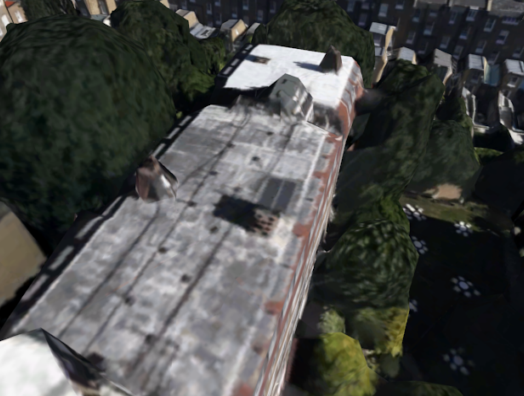  | 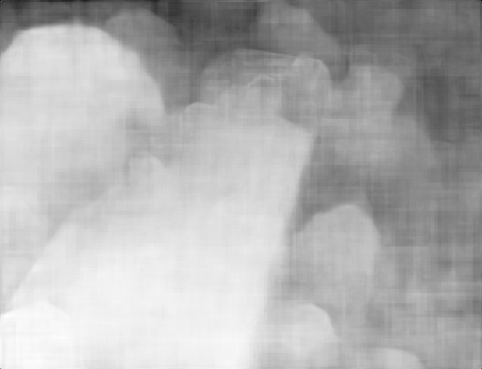  | 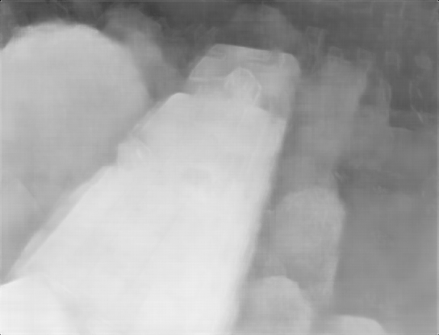  | 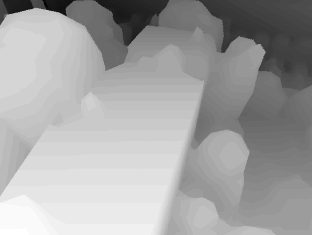  |
| 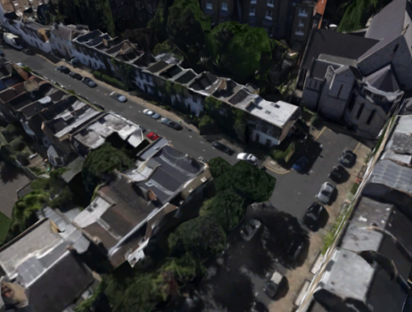  | 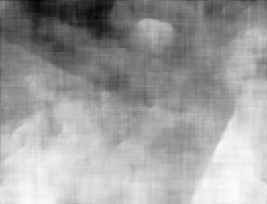  | 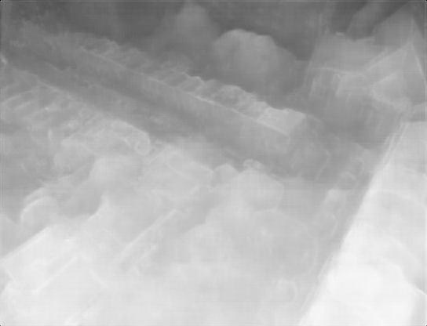  | 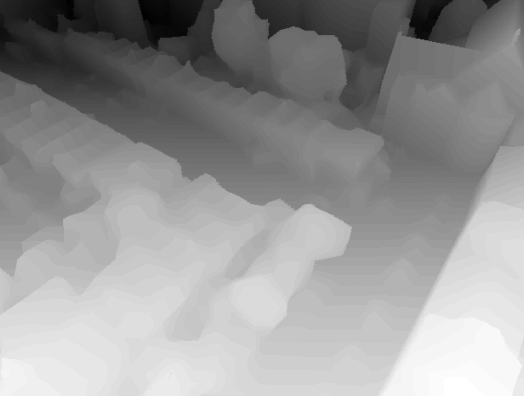  |
| 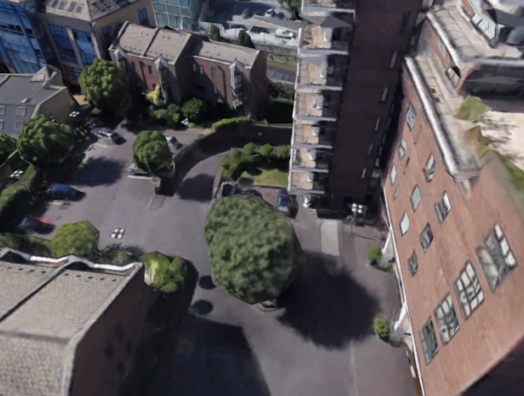 | 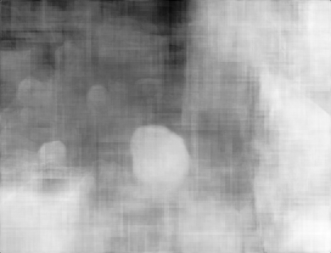 | 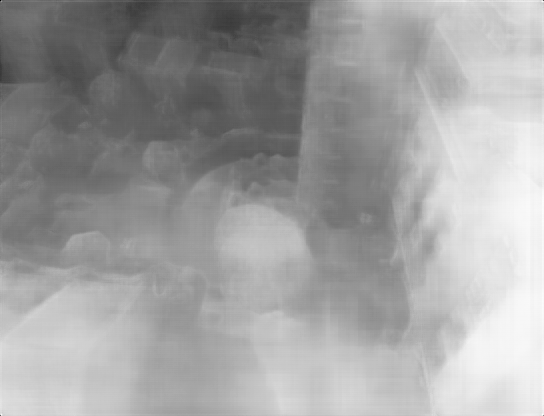 | 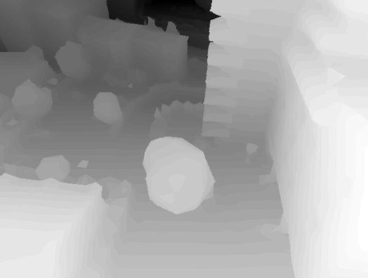 |
